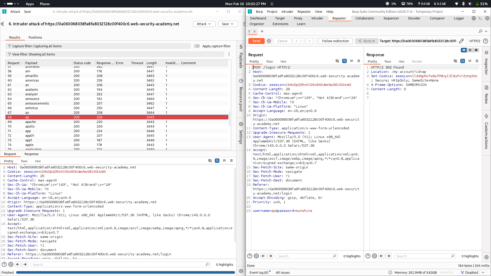

# Lab 04: Username enumeration via subtly different responses

## Category
Authentication (Username Enumeration)

## Vulnerability Summary
The application is vulnerable to username enumeration and brute-force attacks due to subtle differences in the error messages returned during login attempts. By identifying these minor discrepancies, an attacker can confirm the existence of valid usernames and subsequently target them for password cracking.

## Attack Methodology
1. **Request Interception:** Captured the login request containing the username and password fields using Burp Suite Proxy.
2. **Brute-Force Configuration:** Sent the request to Burp Intruder to automate the testing of multiple values from a provided list.
3. **Subtle Analysis:** Analyzed the server's responses to detect minute differences in the "Invalid username or password" message.
4. **Identification:** Observed that the presence or absence of a trailing period (".") in the error message served as a reliable indicator for distinguishing between valid and invalid usernames.

## Technical Root Cause
The server fails to return a perfectly uniform error message for all failed authentication attempts. A logic error in the backend code causes a subtly different string (specifically the inclusion of an extra period) to be returned when a username exists but the password is incorrect, versus when the username itself is invalid.

## Impact
This flaw enables attackers to perform efficient username enumeration, which is a critical precursor to targeted brute-force or credential stuffing attacks. Once valid usernames are identified, the probability of a successful account takeover increases significantly.
