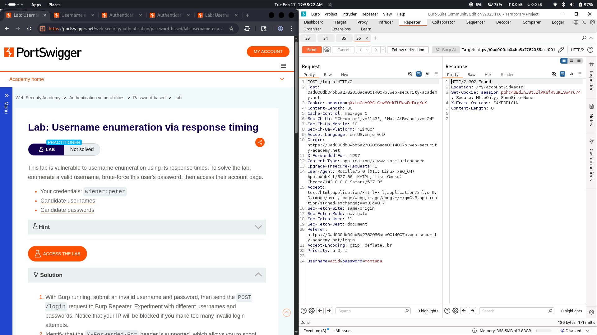

# Lab 05: Username enumeration via response timing

## Category
Authentication (Username Enumeration)

## Vulnerability Summary
The application is vulnerable to username enumeration and brute-force attacks due to measurable timing differences in server responses during login attempts. An attacker can distinguish between valid and invalid usernames based on the response time, enabling account enumeration and potential takeover.

## Attack Methodology
1. **Request Interception:** Captured the login request containing the credentials `test:test` using Burp Suite Proxy.
2. **Intruder Setup:** Sent the request to Burp Intruder to automate payload injection for username/password brute-forcing.
3. **Timing Analysis:** Observed response times for different login attempts to identify patterns indicating valid usernames.
4. **Identification:** Noted that valid usernames with incorrect passwords took approximately 800ms, while invalid usernames returned responses within 200ms.

## Technical Root Cause
The authentication logic performs sequential validation: when a username exists, the system verifies the password (taking ~800ms), but when a username is invalid, it redirects immediately (~200ms) without password verification. This timing discrepancy allows attackers to enumerate valid usernames by measuring response times.

## Impact
This timing-based enumeration enables attackers to identify valid usernames efficiently. Once valid accounts are discovered, they become targets for focused brute-force or credential stuffing attacks, significantly increasing the risk of account takeover.
