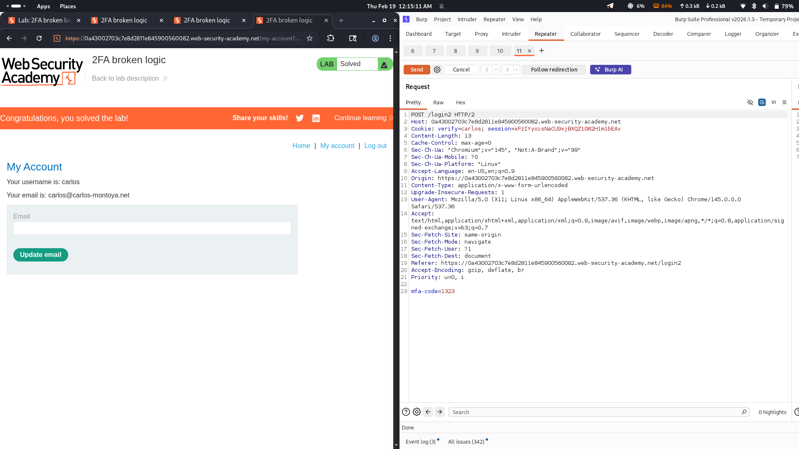

# Lab 08: 2FA Broken Logic

## Category
Authentication (2FA Broken Logic)

## Vulnerability Summary
The application implements two-factor authentication (2FA) as an additional security layer after the initial login. However, there is a critical logic flaw in the 2FA protection mechanism. The server does not properly validate or rate-limit the MFA code submission, allowing an attacker to brute-force the verification code and gain unauthorized access to user accounts.

## Attack Methodology
1. **Credential Authentication:** Successfully logged in using the compromised user credentials for the target account.
2. **Request Capture:** Intercepted the second request in the authentication flow, which prompts for the MFA/2FA verification code.
3. **Intruder Configuration:** Sent the captured request to Burp Intruder and configured a brute-force attack targeting the MFA code parameter.
4. **Code Bruteforcing:** Executed the attack to iterate through possible MFA code combinations.
5. **Access Granted:** Identified the correct MFA code from the response differences and successfully bypassed the 2FA protection.

## Technical Root Cause
The server has a serious vulnerability in its 2FA implementation. The MFA code verification endpoint lacks proper rate-limiting and brute-force protection mechanisms. This allows an attacker to submit unlimited guesses for the verification code without being blocked or triggering any security alerts. The absence of code expiration, attempt limiting, or progressive delays between submissions makes the 2FA implementation ineffective.

## Impact
The user account of `carlos` has been completely compromised. An attacker can:
- Bypass two-factor authentication through brute-force attacks
- Gain full unauthorized access to protected user accounts
- Access sensitive data and perform actions on behalf of the compromised user
- Potentially escalate privileges or pivot to other systems
