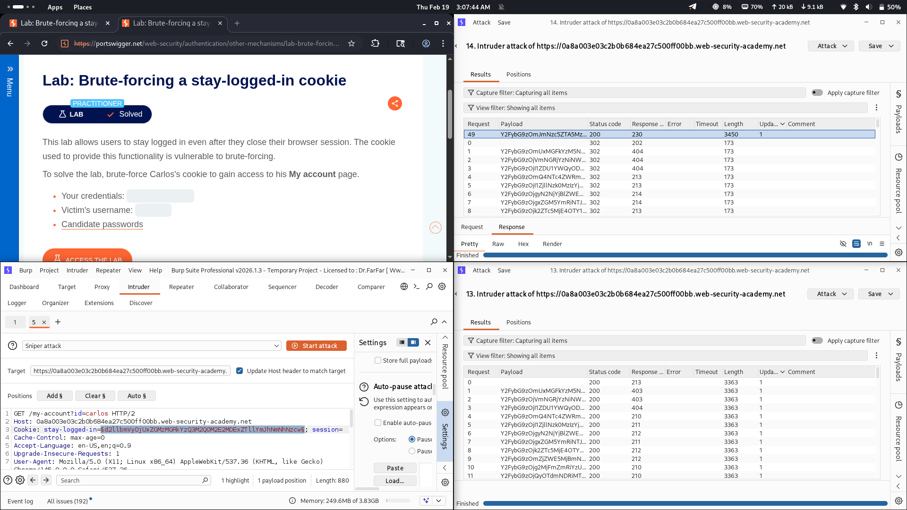

# Lab 09: Brute-forcing a Stay-Logged-In Cookie

## Category
Authentication (Brute-forcing a Stay-Logged-In Cookie)

## Vulnerability Summary
The application implements a "stay logged in" feature using a session cookie that is encoded in Base64 format. The cookie contains user credentials in the format `base64{username:password}`. This encoding is reversible and provides no real security, allowing an attacker to decode, analyze, and brute-force the cookie values to gain unauthorized access to other user accounts.

## Attack Methodology
1. **Login Request Capture:** Intercepted the login request and captured the stay-logged-in session cookie.
2. **Cookie Analysis:** Decoded the Base64 cookie to understand its structure (e.g., `wiener:peter`).
3. **Target Identification:** Identified the target user `carlos` for the brute-force attack.
4. **Brute-Force Configuration:** Modified the cookie value to target the `carlos` account and configured Burp Intruder to iterate through possible password combinations.
5. **Grep Match Analysis:** Set up grep matching to identify invalid email/error responses to filter out failed attempts.
6. **Account Compromised:** Successfully identified the valid cookie combination and gained access to Carlos's account.

## Technical Root Cause
The server has a critical flaw in its session management implementation. The stay-logged-in cookie uses weak Base64 encoding without any cryptographic signing or hashing. Additionally, the server does not implement proper rate-limiting or account lockout mechanisms for invalid cookie attempts. This allows attackers to brute-force cookie values without detection. The lack of secure session token generation and validation makes the authentication mechanism vulnerable to offline decoding and online brute-force attacks.

## Impact
The user account of `carlos` has been completely compromised. An attacker can:
- Bypass authentication through brute-forced stay-logged-in cookies
- Gain full unauthorized access to the compromised user's account page
- Access sensitive personal data and perform actions on behalf of the victim
- Potentially escalate privileges or pivot to other systems using the compromised account
