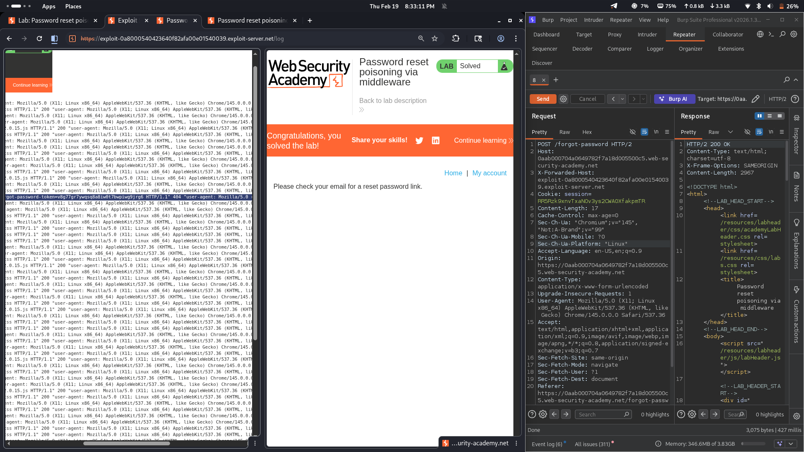

# Lab 11: 2FA Broken Logic

## Category
Authentication (2FA Broken Logic)

## Vulnerability Summary
The application implements a two-factor authentication (2FA) mechanism, but contains a critical logic flaw in the verification process. The server fails to properly validate that the user attempting to complete the 2FA step is the same user who initiated the login process. This allows an attacker to intercept the 2FA request and substitute their own username, effectively bypassing 2FA protection for any user account.

## Attack Methodology
1. **Initial Login:** Logged in with legitimate credentials for a standard user account (e.g., `wiener`).
2. **2FA Request Interception:** Captured the HTTP request during the 2FA verification step using Burp Suite.
3. **Parameter Manipulation:** Modified the request parameters, changing the username from the authenticated user (`wiener`) to the target administrator account (`carlos`).
4. **Cookie Substitution:** Replaced session cookies and identifiers to match the target administrator account.
5. **Request Forwarding:** Forwarded the manipulated request to the server.
6. **Unauthorized Access:** The server accepted the modified request and granted administrative access without proper validation.

## Technical Root Cause
The application has a severe authentication logic flaw in its 2FA implementation:
- **Session-State Mismatch:** The server does not maintain a secure server-side session state linking the 2FA verification request to the original authentication attempt.
- **Client-Side Trust:** The application trusts client-supplied parameters (username, session cookies) during the 2FA verification step without cross-referencing them against server-side session data.
- **Missing Binding:** There is no cryptographic binding between the initial authentication step and the 2FA verification step, allowing an attacker to mix and match credentials from different users.
- **Insufficient Validation:** The backend fails to verify that the user completing 2FA is the same user who provided valid credentials in the first authentication factor.

## Impact
The administrator account `carlos` has been completely compromised. An attacker can:
- Bypass 2FA protection on any user account including administrators
- Gain full unauthorized access to privileged accounts
- Perform administrative operations such as deleting users or modifying system configurations
- Completely undermine the security benefits of multi-factor authentication
- Potentially escalate privileges and pivot to other systems using compromised admin access
