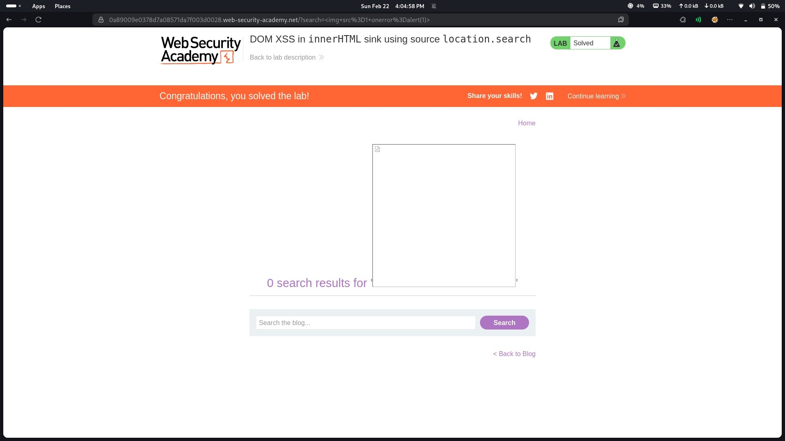

# Lab 04: DOM XSS in innerHTML Sink Using Source location.search

## Category
Cross-Site Scripting (XSS) - DOM-based

## Vulnerability Summary
The website contains a DOM-based XSS vulnerability in the search functionality. The vulnerability exists because the application uses `innerHTML` to dynamically update the page content with user-controlled data from the `location.search` parameter without proper sanitization. This allows attackers to inject and execute arbitrary JavaScript in the victim's browser.

## Attack Methodology
1. **Reconnaissance:** Identified the search feature that reflects user input from the URL query parameters.
2. **Source Analysis:** Discovered that the application reads data directly from `location.search` (the URL query string).
3. **Sink Identification:** Found that the application uses `innerHTML` to write the untrusted data into the DOM.
4. **Payload Injection:** Crafted a malicious URL containing a JavaScript payload in the query parameter.
5. **Execution:** When a victim visits the malicious URL, the payload executes in their browser context without ever being sent to the server.
6. **Verification:** Confirmed successful script execution through browser developer tools or observable behavior (such as alert dialogs).



## Technical Root Cause
The vulnerability stems from unsafe DOM manipulation practices:

- **Unsafe Sink Usage:** The application uses `innerHTML` to insert user-controlled data directly into the DOM. This property parses the content as HTML, allowing script execution.
- **Untrusted Source:** Data is read from `location.search`, which is fully controlled by the attacker through URL manipulation.
- **No Sanitization:** The application fails to sanitize or encode the input before inserting it into the DOM.
- **Client-Side Only:** Unlike reflected or stored XSS, this vulnerability exists entirely on the client-side, making it harder to detect with traditional server-side scanners.

### Vulnerable Code Pattern
```javascript
// Dangerous pattern - DO NOT use
var searchQuery = location.search;
document.getElementById('search-result').innerHTML = searchQuery;
```

## Impact
- **Account Compromise:** Attackers can steal session tokens, authentication cookies, or JWT tokens using JavaScript (for example, `document.cookie`), leading to full account takeover.
- **Session Hijacking:** Malicious scripts can hijack active user sessions and perform actions on behalf of the victim.
- **Identity Theft:** Attackers can create fake login forms or capture credentials entered by the user.
- **Phishing Attacks:** The page content can be modified to display misleading information or redirect users to phishing sites.
- **Malware Distribution:** Users can be forced to download malicious files or visit malware-hosting sites.
- **Keylogging:** JavaScript can capture all keystrokes, exposing sensitive information like passwords and credit card numbers.

## Mitigation
To prevent DOM-based XSS vulnerabilities, implement the following security measures:

### 1. Use Safe DOM APIs
Replace `innerHTML` with safer alternatives that automatically encode content:

```javascript
// Safe pattern - USE this instead
var searchQuery = location.search;
document.getElementById('search-result').textContent = searchQuery;
```

### 2. Input Validation and Sanitization
If you must use `innerHTML`, sanitize the input using a trusted library like DOMPurify:

```javascript
var searchQuery = location.search;
var sanitized = DOMPurify.sanitize(searchQuery);
document.getElementById('search-result').innerHTML = sanitized;
```

### 3. Avoid Dangerous Sinks
Be cautious when using these dangerous DOM sinks with untrusted data:
- `innerHTML`
- `outerHTML`
- `document.write()`
- `document.writeln()`
- `element.insertAdjacentHTML()`
- `document.domain`

### 4. Content Security Policy (CSP)
Implement a strong CSP header to restrict script execution:

```
Content-Security-Policy: default-src 'self'; script-src 'self'; object-src 'none'
```

### 5. Use Modern Frameworks
Modern JavaScript frameworks (React, Angular, Vue.js) provide built-in XSS protection by automatically encoding data bindings.

### 6. Security Testing
- Use automated DOM XSS scanners (such as DOM Invader)
- Perform manual code reviews focusing on DOM manipulation
- Conduct regular penetration testing with client-side focus

### 7. Security Awareness
- Train developers on DOM-based XSS risks
- Document safe coding patterns
- Establish code review checklists for DOM operations
