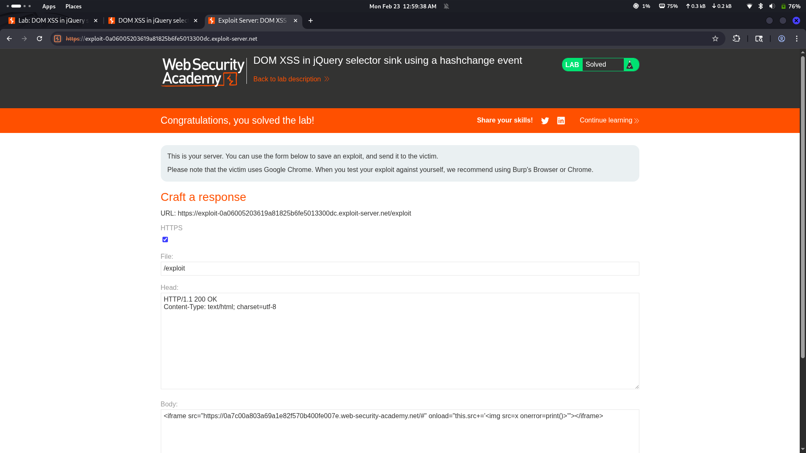

# Lab 06: DOM XSS in jQuery Selector Sink Using hashchange Event

## Category
Cross-Site Scripting (XSS) - DOM-based

## What I Found
The website has a DOM XSS vulnerability in its jQuery selector. The issue is that the code reads data from the URL hash (`#` fragment) and passes it directly to jQuery without any validation. When the hash changes, the `hashchange` event triggers and jQuery processes whatever is in the URL fragment as if it were a CSS selector.

## How I Exploited It
1. Found that the page listens to the `hashchange` event
2. Noticed the URL hash is passed directly to jQuery's `$()` function
3. Injected a payload like `` in the hash part of the URL
4. jQuery treated it as a selector and executed the JavaScript

## Why It Happens
The code trusts the URL hash blindly. jQuery's `$()` function can interpret certain inputs as HTML instead of CSS selectors, and when that happens, the browser executes any embedded scripts. No input validation, no filtering — just raw trust.

## Impact
- Session cookies can be stolen
- Attackers can perform actions on behalf of the victim
- Users can be redirected to malicious sites
- Account takeover is possible

## Fix
- **Sanitize input** — never trust URL fragments
- **Use `.text()` instead of `.html()`** when inserting user data
- **Validate the hash** before passing it to jQuery
- **Consider using safer methods** like `document.querySelector()` with proper validation
