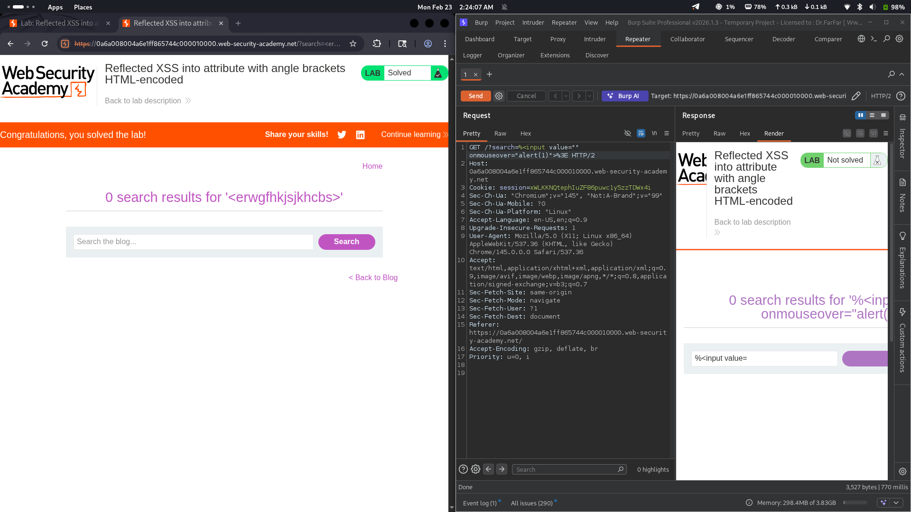

# Lab 07: Reflected XSS into Attribute with Angle Brackets HTML-Encoded

## Category
Cross-Site Scripting (XSS) - Reflected

## What I Found
The website has a reflected XSS vulnerability in the search feature. The server blocks angle brackets (`<` and `>`) by HTML-encoding them, but that's it — no other sanitization happens. The problem is that user input is reflected inside an HTML attribute, and quotes (`"`) aren't filtered. This lets me break out of the attribute and inject JavaScript.

## How I Exploited It
1. Found the search parameter that reflects input back in the page
2. Noticed angle brackets are encoded but quotes aren't
3. Injected a payload like `" onmouseover="alert(1)` to break out of the attribute
4. When a user hovers over the element, the JavaScript executes

## Why It Happens
The developers thought encoding `<` and `>` was enough protection. But when user input lands inside an HTML attribute (like `value=""` or `href=""`), the real danger is quotes — they let attackers escape the attribute and add event handlers or other malicious code.

## Impact
- Session cookies can be stolen
- Phishing attacks are possible
- Attackers can perform actions on behalf of the victim
- Account takeover

## Fix
- **Sanitize all input** — not just angle brackets, also quotes, backticks, and other special characters
- **Use a strict Content Security Policy (CSP)** to limit script execution
- **Use modern frameworks** (React, Angular, Vue) that handle encoding automatically
- **Validate input context** — know where user data will appear (attribute, body, URL) and encode accordingly
