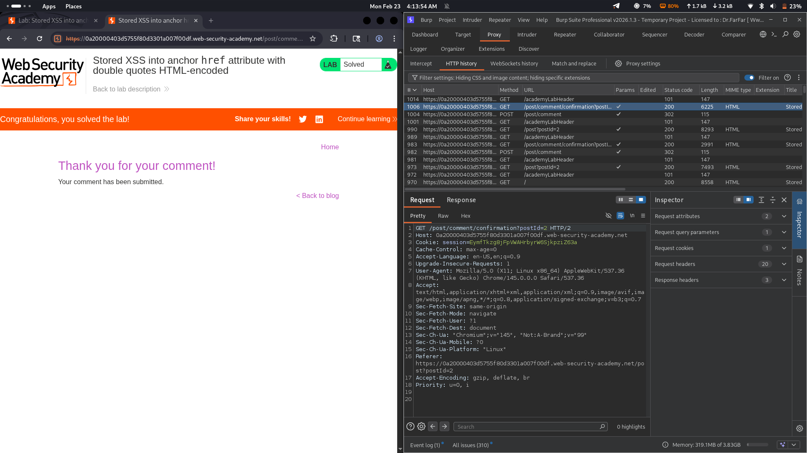

# Lab 08: Stored XSS into Anchor href Attribute with Double Quotes HTML-Encoded

## Category
Cross-Site Scripting (XSS) - Stored

## What I Found
The website has a stored XSS vulnerability in the comment section. The site blocks angle brackets (`<>`) and double quotes (`""`), but the input goes into an anchor `href` attribute. I submitted a payload using the `javascript:` protocol that executes when someone clicks the link.

## How I Exploited It
1. Found the comment feature that stores user input
2. Noticed the input appears in an anchor `href` attribute
3. Angle brackets and quotes are blocked, but `javascript:` protocol isn't filtered
4. Submitted a payload like `javascript:alert(1)` as the URL
5. When a user clicks the link, the JavaScript executes

## Why It Happens
The developers focused on blocking common XSS patterns (`<script>`, quotes) but forgot that `href` attributes can execute JavaScript directly through the `javascript:` protocol. No validation on what type of URL is allowed.

## Impact
- Session cookie theft
- Session hijacking
- Account compromise
- Phishing attacks

## Fix
- **Only allow http/https URLs** — block `javascript:`, `data:`, and other dangerous protocols
- **Server-side input validation** — validate URLs before storing them
- **Use modern frameworks** that handle encoding automatically
- **Add CSP headers** to restrict script execution sources
