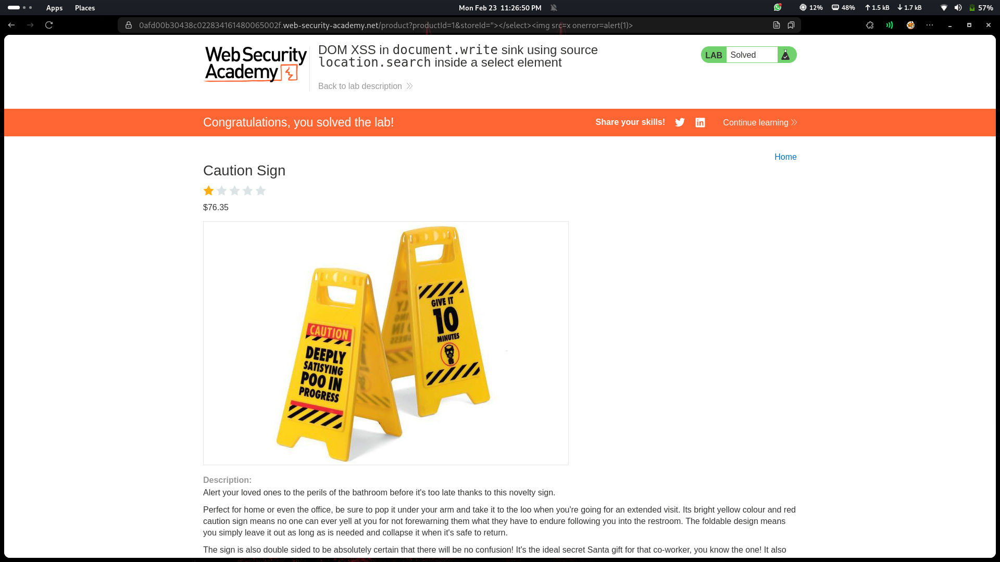

# Lab 10: DOM XSS in document.write Sink Using Source location.search Inside a Select Element

## Category
Cross-Site Scripting (XSS) - DOM-based

## What I Found
The website has a DOM-based XSS vulnerability in its stock checker functionality. The application uses `document.write()` to dynamically populate a `<select>` element with values taken directly from the URL's query string (`location.search`). This creates a dangerous sink where attacker-controlled input is written directly into the DOM without any sanitization.

## How I Exploited It
1. **Reconnaissance:** Identified the stock checker feature that accepts product IDs via URL parameters
2. **Sink Discovery:** Found that `document.write()` is being used to render options in a `<select>` dropdown
3. **Source Analysis:** Traced the data flow and discovered `location.search` is passed directly to the sink
4. **Payload Injection:** Crafted a malicious URL with a script payload in the query parameter
5. **Execution:** When the page loads, the injected JavaScript executes in the victim's browser

Example payload:
```
?productId=
```



## Why It Happens
The developers made two critical mistakes:
1. **Using `document.write()`** — This method writes raw HTML directly into the document, making it extremely dangerous when used with user input
2. **Trusting URL parameters** — Data from `location.search` is attacker-controlled and should never be written to the DOM without proper encoding

The combination of a dangerous sink (`document.write`) with an untrusted source (`location.search`) creates a perfect storm for DOM XSS.

## Impact
- **Session Hijacking** — Attackers can steal session cookies using `document.cookie`
- **Account Takeover** — Full compromise of user accounts is possible
- **Cookie Theft/Modification** — Sensitive authentication tokens can be exfiltrated
- **Phishing Attacks** — Users can be redirected to malicious lookalike pages
- **Keylogging** — Attacker scripts can capture all user input on the page
- **Malware Distribution** — Users can be forced to download malicious files

## Fix
To prevent DOM-based XSS vulnerabilities, implement these security measures:

### 1. Never Use document.write()
Avoid `document.write()` entirely, especially with user input. It's an outdated method that bypasses many security mechanisms.

### 2. Use Safe DOM Methods
Replace `document.write()` with safer alternatives:
```javascript
// ❌ Dangerous
document.write(userInput);

// ✅ Safe - creates element properly
const option = document.createElement('option');
option.textContent = userInput;  // textContent automatically encodes
selectElement.appendChild(option);
```

### 3. Use textContent Instead of innerHTML
```javascript
// ❌ Dangerous
element.innerHTML = userInput;

// ✅ Safe
element.textContent = userInput;
```

### 4. Validate and Encode Input
Always validate input against an allowlist and encode data based on the output context (HTML, JavaScript, URL, CSS).

### 5. Implement Content Security Policy (CSP)
Add a strong CSP header to restrict script execution:
```
Content-Security-Policy: default-src 'self'; script-src 'self'; object-src 'none'
```

### 6. Use Modern Frameworks
Frameworks like React, Vue, and Angular automatically encode output by default, reducing XSS risk.

## References
- [PortSwigger: DOM-based XSS](https://portswigger.net/web-security/cross-site-scripting/dom-based)
- [OWASP: DOM based XSS](https://owasp.org/www-community/attacks/DOM_based_XSS)
- [MDN: document.write()](https://developer.mozilla.org/en-US/docs/Web/API/Document/write)
