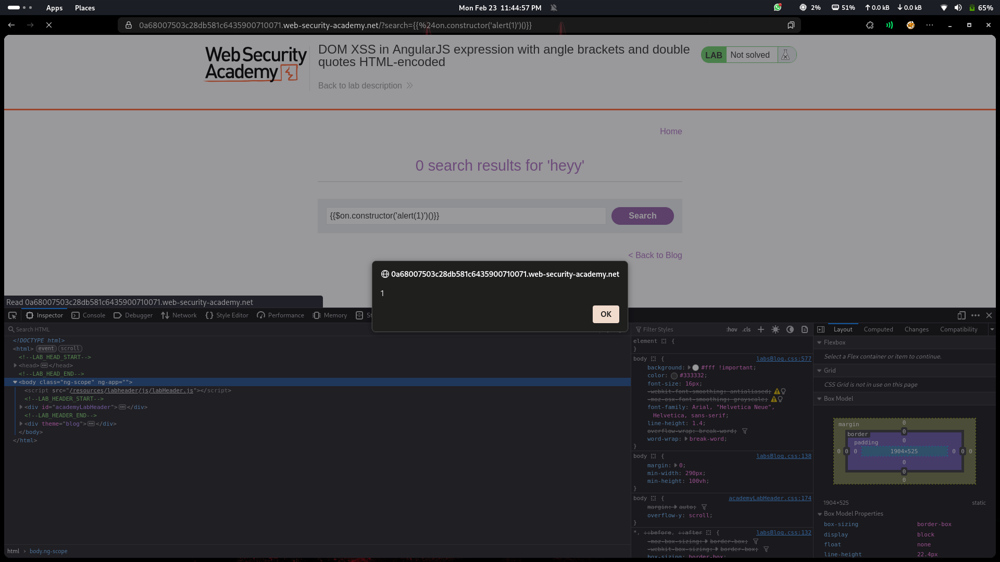
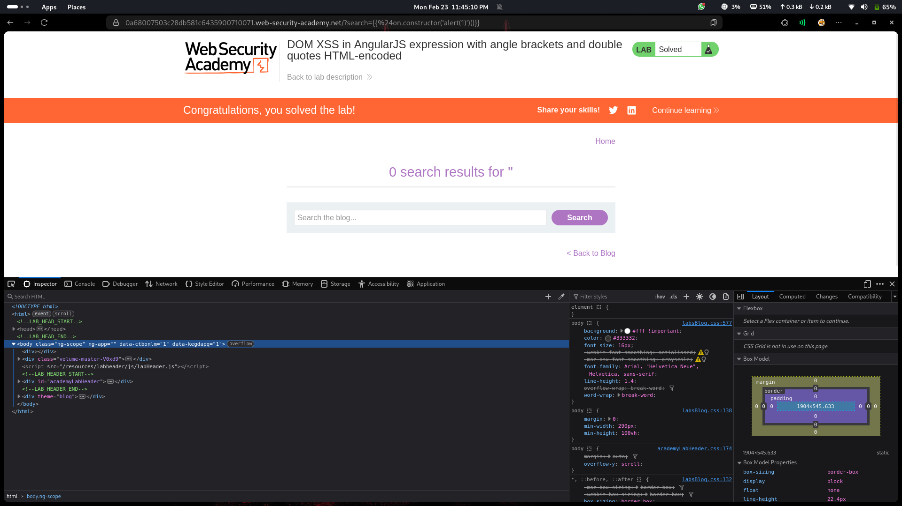

# Lab 11: DOM XSS in AngularJS Expression with Angle Brackets and Double Quotes HTML-Encoded

## Category
Cross-Site Scripting (XSS) - DOM-based

## What I Found
The website uses AngularJS and is vulnerable to a DOM-based XSS attack through AngularJS expression injection. Even though angle brackets (`<`, `>`) and double quotes (`"`) are HTML-encoded, the application still evaluates AngularJS expressions inside curly brackets `{{ }}`. This creates a loophole where an attacker can inject malicious expressions that bypass the HTML encoding and execute arbitrary JavaScript.

## How I Exploited It
1. **Reconnaissance:** Identified that the application uses AngularJS framework (looked for `ng-app` directive)
2. **Input Testing:** Discovered that user input is reflected inside AngularJS expression context
3. **Bypass Discovery:** Found that while HTML special characters are encoded, AngularJS expressions inside `{{ }}` are still evaluated
4. **Payload Construction:** Crafted a payload using AngularJS expression syntax that doesn't rely on angle brackets
5. **Execution:** The expression was evaluated by AngularJS, triggering the alert box

Example payload:
```
{{constructor.constructor('alert(1)')()}}
```

Or using Angular's built-in services:
```
{{$on.constructor('alert(1)')()}}
```





## Why It Happens
The vulnerability exists due to a fundamental misunderstanding of how AngularJS processes expressions:

1. **HTML Encoding is Not Enough:** The developers encoded angle brackets and quotes, thinking this would prevent XSS. However, AngularJS expressions don't require these characters to execute code.

2. **Expression Evaluation:** AngularJS automatically evaluates anything inside `{{ }}` as an expression. When user input is allowed inside these brackets, it becomes executable code.

3. **Sandbox Bypass:** Older versions of AngularJS had a client-side sandbox that was meant to restrict expression evaluation, but multiple bypasses were discovered. The framework's sanitization through `ng-app` doesn't protect against crafted expressions.

4. **Dangerous Pattern:** Using interpolation (`{{ }}`) with user-controllable data is inherently dangerous in AngularJS.

## Impact
- **Account Takeover:** Attackers can craft malicious links that, when clicked, execute arbitrary JavaScript in the victim's session
- **Session Hijacking:** JavaScript can access `document.cookie` and steal authentication tokens
- **Phishing:** Attackers can modify the page content to display fake login forms
- **Data Exfiltration:** Sensitive user data can be sent to attacker-controlled servers
- **Credential Harvesting:** Keyloggers can be injected to capture passwords
- **Malware Distribution:** Users can be redirected to malicious download pages

## Fix
To prevent AngularJS-based DOM XSS vulnerabilities, implement these security measures:

### 1. Avoid AngularJS (Recommended)
AngularJS (version 1.x) is end-of-life and has known security limitations. Migrate to a modern framework like:
- **Angular (2+)** — Complete rewrite with better security
- **React** — Uses JSX with automatic escaping
- **Vue.js** — Has built-in XSS protections

### 2. Use Strict Contextual Escaping
If you must use AngularJS, implement strict output encoding:
```javascript
// Use $sce service for strict contextual escaping
app.controller('MyCtrl', function($scope, $sce) {
    $scope.safeValue = $sce.trustAsHtml(userInput);
});
```

### 3. Never Interpolate User Input
Avoid placing user-controlled data directly inside `{{ }}`:
```javascript
// ❌ Dangerous
<div>{{userInput}}</div>

// ✅ Safe - use ng-bind
<div ng-bind="userInput"></div>
```

### 4. Disable AngularJS Expression Evaluation
For user input areas, prevent AngularJS from processing them:
```javascript
// Use ng-non-bindable to skip expression evaluation
<div ng-non-bindable>{{userInput}}</div>
```

### 5. Implement Content Security Policy (CSP)
Add CSP headers to restrict script execution:
```
Content-Security-Policy: default-src 'self'; script-src 'self'; object-src 'none'
```

### 6. Input Validation
Validate and sanitize all user input on the server-side using allowlists for expected patterns.

### 7. Update AngularJS
If migration isn't possible, ensure you're on the latest AngularJS version (1.8.x) which has improved security mitigations.

## References
- [PortSwigger: DOM XSS with AngularJS](https://portswigger.net/web-security/cross-site-scripting/dom-based/lab-angularjs-expression)
- [OWASP: AngularJS Security](https://owasp.org/www-community/Security/AngularJS)
- [AngularJS Security Guide](https://docs.angularjs.org/guide/security)
- [AngularJS End of Life](https://blog.angular.io/discontinued-long-term-support-for-angularjs-cc066b82e65a)
