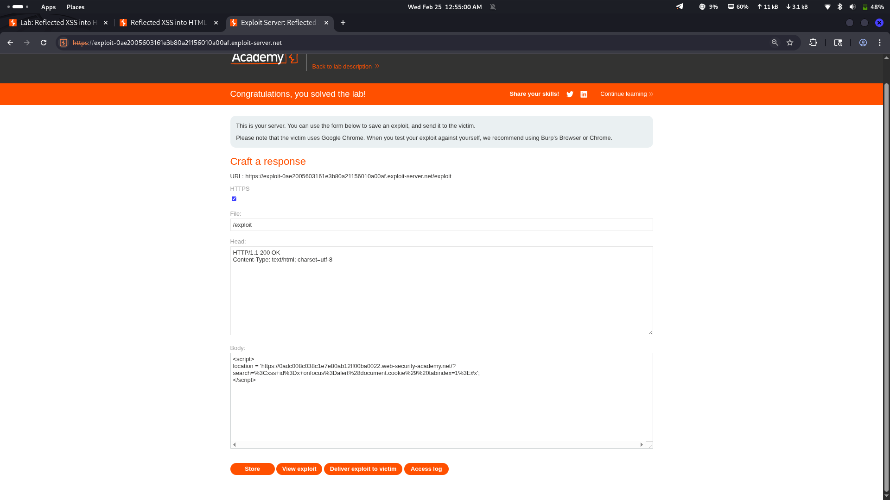

# Lab 15: Reflected XSS into HTML context with all tags blocked except custom ones

## Category
Cross-Site Scripting (XSS) - Reflected

## Vulnerability Summary
The website implements a WAF that blocks all known HTML tags using a blacklist approach. However, the filter fails to account for custom/non-standard HTML tags. By using a made-up tag like `<xss>`, the attacker can bypass the WAF and execute JavaScript via event handlers such as `onfocus` combined with `autofocus`.

## Attack Methodology
1. **Reconnaissance:** Identified that user input is reflected in the HTML response.
2. **WAF Detection:** Standard tags like `<script>`, ``, `<svg>` were blocked by the WAF.
3. **Filter Analysis:** Tested various tag names to understand the filtering logic.
4. **Bypass Discovery:** Found that custom/non-standard tags (e.g., `<xss>`) are not blocked since they don't exist in the WAF's blacklist.
5. **Payload Construction:** Created a payload using a custom tag with `autofocus` and `onfocus` event handler.
6. **Execution:** Successfully executed JavaScript without requiring any user interaction.



## Technical Root Cause
The WAF uses a **blacklist-based approach** that blocks known HTML tags but has no knowledge of custom tags:

- **Incomplete Coverage:** The WAF only blocks tags it recognizes as potentially malicious.
- **No Whitelist Enforcement:** Unknown tags are allowed by default instead of being blocked.
- **Event Handler Execution:** The `onfocus` event handler fires automatically when combined with `autofocus`.

### Payload Used
```html
<xss autofocus onfocus=alert(1)>
```

This works because:
- `<xss>` is not a standard HTML tag, so it's not in the blacklist.
- `autofocus` automatically focuses the element on page load.
- `onfocus` fires when the element receives focus, executing the JavaScript.

## Impact
- **Zero-Click Exploitation:** The `autofocus` attribute triggers the exploit automatically when the page loads — no user interaction required.
- **Session Hijacking:** Attacker can steal session cookies and authentication tokens.
- **Credential Theft:** Malicious scripts can capture user input or redirect to phishing pages.
- **Browser Takeover:** Full control over the victim's browser session on the affected domain.

## Mitigation

### 1. Use Whitelist Instead of Blacklist
**Most critical fix.** Only allow known-safe tags and attributes:

```
❌ Bad: Block <script>, , <svg>, etc. (blacklist)
✅ Good: Only allow <p>, <b>, <i>, <span> etc. (whitelist)
```

### 2. Output Encoding
Encode all user-controllable data in HTML context:
- `<` → `&lt;`
- `>` → `&gt;`
- `"` → `&quot;`
- `'` → `&#x27;`

### 3. Content Security Policy (CSP)
Implement strict CSP to limit script execution:
```
Content-Security-Policy: default-src 'self'; script-src 'self'; object-src 'none'
```

### 4. HTTP Security Headers
Add protective headers:
```
X-Content-Type-Options: nosniff
X-XSS-Protection: 1; mode=block
```

### 5. WAF Best Practices
- Use WAF as **defense in depth**, not the primary security control.
- Regularly update and audit WAF rules.
- Combine with input validation and output encoding.

---
*Lab completed on: 2026-02-25*
