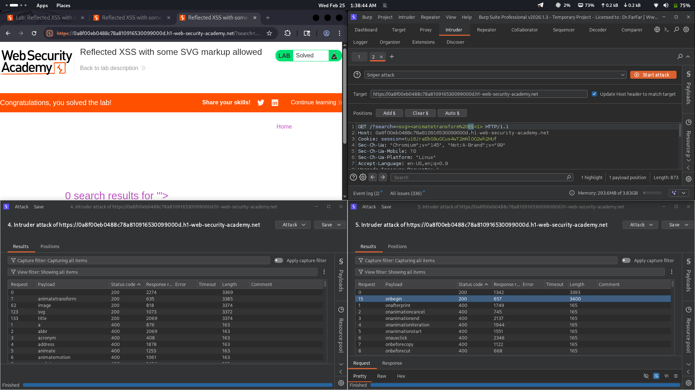

# Lab 16: Reflected XSS — SVG based bypass

## Category
Cross-Site Scripting (XSS) - Reflected

## Vulnerability Summary
The website implements a WAF that blocks most HTML tags but fails to properly sanitize SVG elements. The filter allows `<svg>` and `<animatetransform>` tags while missing the dangerous event handlers that can be embedded within them. The `onbegin` event handler inside SVG elements fires automatically on page load, enabling zero-click XSS exploitation.

## Attack Methodology
1. **Reconnaissance:** Identified that user input is reflected in the HTML response.
2. **WAF Detection:** Standard HTML tags like `<script>`, ``, `<body>` were blocked by the WAF.
3. **Filter Analysis:** Tested SVG-related tags to understand filtering gaps.
4. **Bypass Discovery:** Found that `<svg>` and `<animatetransform>` tags are allowed, and event handlers like `onbegin` are not filtered.
5. **Payload Construction:** Created an SVG payload with `onbegin` event that fires automatically.
6. **Execution:** Successfully executed JavaScript without any user interaction.



## Technical Root Cause
The WAF uses a **blacklist-based approach** with incomplete SVG coverage:

- **SVG Tag Allowed:** The `<svg>` tag is not included in the blocklist.
- **Event Handler Gap:** The `onbegin` event handler is not recognized as malicious.
- **Automatic Execution:** The `onbegin` event fires immediately when the SVG loads — no click or hover required.

### Payload Used
```html
<svg>
  <animatetransform onbegin=alert(1)>
</svg>
```

This works because:
- `<svg>` is a valid XML/SVG element not covered by the blacklist.
- `<animatetransform>` is an SVG animation element.
- `onbegin` fires automatically when the animation begins (on page load).

## Impact
- **Zero-Click Exploitation:** The `onbegin` event triggers instantly when the page loads — victim doesn't need to click or interact with anything.
- **Session Hijacking:** Attacker can steal session cookies and authentication tokens via JavaScript.
- **Credential Theft:** Malicious scripts can capture keystrokes or redirect to phishing pages.
- **Browser Takeover:** Full control over the victim's browser session on the affected domain.

## Mitigation

### 1. Switch from Blacklist to Whitelist
**Most critical fix.** Only allow known-safe tags and attributes:

```
❌ Bad: Block known dangerous tags (blacklist)
✅ Good: Only allow explicitly trusted tags (whitelist)
```

### 2. SVG-Specific Controls
If SVG is required:
- Only allow safe SVG elements (e.g., `<svg>`, `<rect>`, `<circle>` without scripting).
- Block all event handlers inside SVG (`onbegin`, `onload`, `onclick`, etc.).
- Strip `<script>` tags and JavaScript URLs within SVG.

### 3. Use DOMPurify for SVG Sanitization
Use a proven library like DOMPurify to sanitize SVG content:

```javascript
const clean = DOMPurify.sanitize(userInput, {
  USE_PROFILES: { svg: true }
});
```

### 4. Implement Strict Content Security Policy (CSP)
Add CSP headers to block inline scripts and unauthorized sources:

```
Content-Security-Policy: default-src 'self'; script-src 'self'; object-src 'none'; base-uri 'self'
```

### 5. HTTP Security Headers
Add protective headers:
```
X-Content-Type-Options: nosniff
X-XSS-Protection: 1; mode=block
```

### 6. WAF Best Practices
- Use WAF as **defense in depth**, not primary security.
- Regularly audit and update WAF rules for SVG/XML vectors.
- Combine with input validation and output encoding.

---
*Lab completed on: 2026-02-25*
