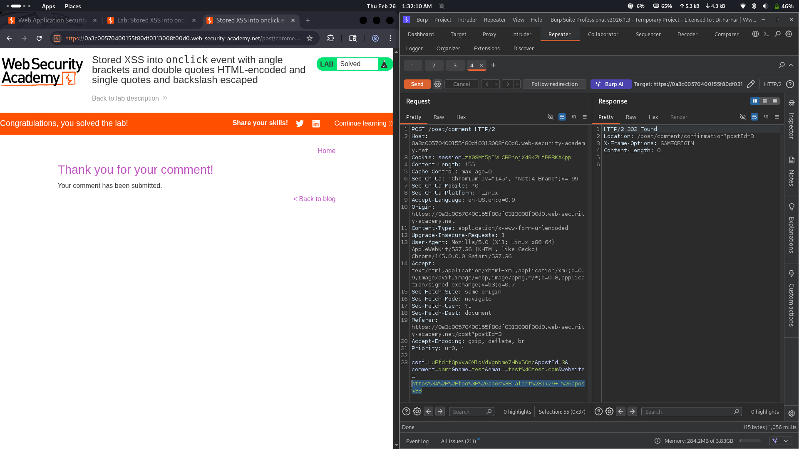

# Lab 20: Stored XSS into onclick event with angle brackets and double quotes HTML-encoded and single quotes and backslash escaped

## Category
Cross-Site Scripting (XSS) - Stored

## Vulnerability Summary
The website has a comment function that stores user input and renders it on the page. The application HTML-encodes angle brackets (`<>`) and double quotes (`"`), and escapes single quotes (`'`) and backslashes (`\`). However, the `onclick` event handler is vulnerable because the escaping is insufficient to prevent breaking out of the attribute context.

## Attack Methodology
1. **Reconnaissance:** Identified that user input is stored in a comment field and rendered within an `onclick` attribute.
2. **Escape Detection:** Found that `<>`, `"`, `'`, and `\` are all escaped/encoded.
3. **Bypass Discovery:** Discovered that the `onclick` attribute can be broken out of using the encoded single quote `&apos;` to terminate the attribute value.
4. **Payload Construction:** Used `&apos;-alert(1)-&apos;` to break out of the onclick attribute and inject JavaScript.
5. **Execution:** When a user clicks the element, the injected script executes.



## Technical Root Cause
The escaping logic fails to properly handle the onclick event context:

- **Incomplete Attribute Escaping:** While quotes and backslashes are escaped, the `&apos;` entity can still break out of the attribute.
- **Event Handler Context:** The `onclick` attribute executes JavaScript, making it a high-risk injection point.
- **Stored Nature:** The payload persists in the server, affecting all users who view the comment.

### Payload Used
```
&apos;-alert(1)-&apos;
```

This works because:
- `&apos;` closes the attribute's quoted value.
- `-alert(1)-` is the injected JavaScript.
- The final `&apos;` re-opens/terminates to maintain valid syntax.

## Impact
- **Session Hijacking:** Attacker can steal session cookies and authentication tokens.
- **Account Compromise:** Malicious scripts can manipulate users into performing unintended actions.
- **Persistent Attack:** Stored XSS affects all users who view the compromised comment.
- **Full JavaScript Execution:** Attacker gains complete control over the page context.

## Mitigation
1. **Use Modern Frameworks:** Frameworks like React, Vue, or Angular automatically escape output.
2. **Implement Strict Input Validation:** Whitelist allowed characters and reject suspicious patterns.
3. **Apply Context-Aware Encoding:** Use proper encoding for HTML, JavaScript, and URL contexts.
4. **Use Content Security Policy (CSP):** Restrict script execution to trusted sources only.

---
*Lab completed on: 2026-02-26*
