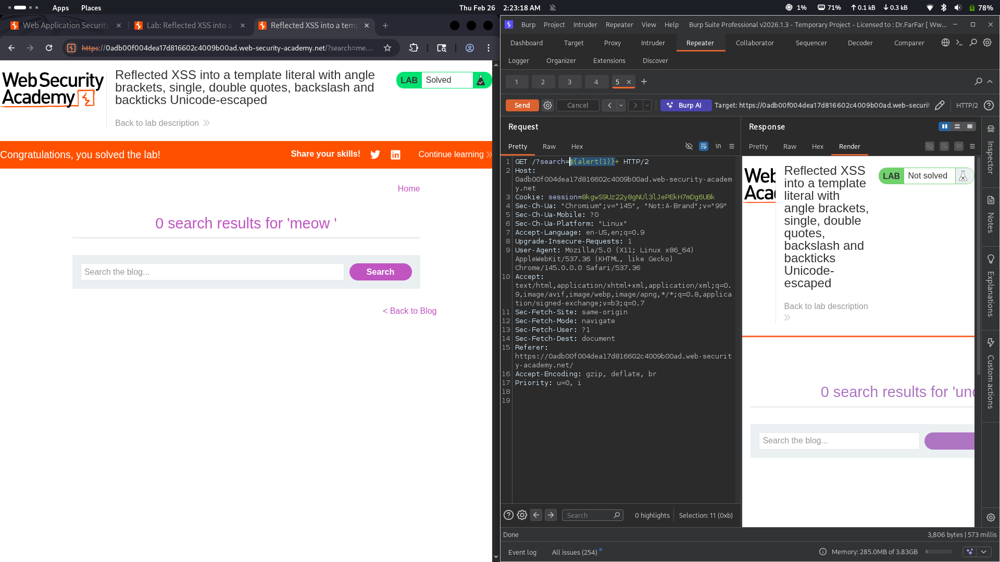

# Lab 21: Reflected XSS into a template literal with angle brackets, quotes, backslash and backticks unicode escaped

## Category
Cross-Site Scripting (XSS) - Reflected

## Vulnerability Summary
The website reflects user input inside a JavaScript template literal. The application escapes angle brackets (`<>`), single quotes (`'`), double quotes (`"`), backslashes (`\`), and backticks (`` ` ``) using unicode encoding. However, the developer uses `${}` interpolation syntax within the template literal, which allows attackers to inject arbitrary JavaScript expressions that execute before any escaping takes effect.

## Attack Methodology
1. **Reconnaissance:** Identified that user input is reflected inside a JavaScript template literal.
2. **Escape Detection:** Found that `<>`, `'`, `"`, `\`, and backticks are all unicode-escaped.
3. **Bypass Discovery:** Discovered that the `${}` interpolation syntax is not filtered — it's a native JavaScript feature for embedding expressions in template literals.
4. **Payload Construction:** Used `${alert(1)}` to inject JavaScript that executes within the template literal context.
5. **Execution:** The expression inside `${}` is evaluated as JavaScript code when the template literal is parsed.



## Technical Root Cause
The developer misunderstood how template literals work in JavaScript:

- **Template Literal Interpolation:** The `${}` syntax is designed to evaluate expressions inside template literals.
- **Escaping Irrelevant:** The escaping applies to the string content, not to expressions inside `${}`.
- **Direct Code Execution:** Anything placed inside `${}` is executed as JavaScript code, bypassing all character escaping.

### Payload Used
```
${alert(1)}
```

This works because:
- `${}` is native JavaScript template literal interpolation syntax.
- The expression inside is evaluated as JavaScript code.
- No escaping or filtering applies to the interpolated expression.

## Impact
- **Instant Script Execution:** Code executes immediately when the template literal is parsed.
- **Session Hijacking:** Attacker can steal session cookies and authentication tokens.
- **Credential Theft:** Malicious scripts can capture user input or redirect to phishing pages.
- **Full JavaScript Control:** Attacker gains complete control over the page's JavaScript context.

## Mitigation
1. **Avoid Template Literal Interpolation:** Never insert user input directly inside `${}` in template literals.
2. **Use String Concatenation with Encoding:** Concatenate strings with properly encoded user data instead.
3. **Use Modern Frameworks:** Frameworks like React, Vue, or Angular automatically handle output encoding.
4. **Avoid innerHTML:** Use `textContent` or `innerText` for inserting user data into the DOM.

---
*Lab completed on: 2026-02-26*
