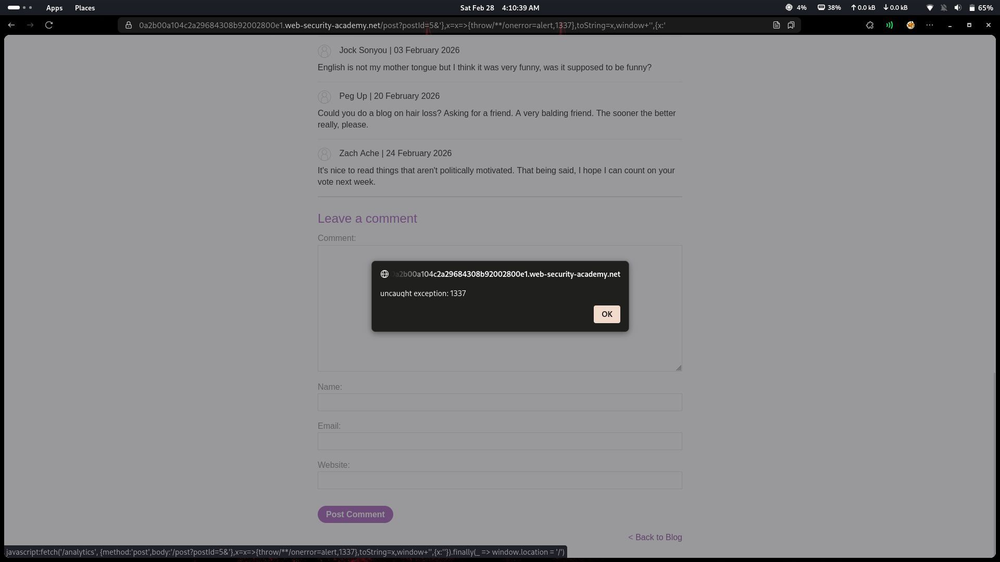

# Lab 29: Reflected XSS in a JavaScript URL with some characters blocked

## Category
Cross-Site Scripting (XSS) - Reflected (JavaScript URL Context with Character Filtering)

## Vulnerability Summary
The website reflects user input inside a JavaScript URL context with certain characters and keywords blocked. However, the filter is incomplete and doesn't block all dangerous characters or patterns. The vulnerability exists because user-controlled data is embedded directly into a JavaScript string without proper encoding. When the victim interacts with the page (specifically clicking the "back to blog" button), the injected JavaScript payload executes, triggering `alert(1337)` and demonstrating arbitrary JavaScript execution.

## Attack Methodology
1. **Reconnaissance:** Identified that user input is reflected inside a JavaScript URL context.
2. **Filter Detection:** Found that multiple strings and variables commonly used in XSS payloads are blocked.
3. **Bypass Discovery:** Discovered that the `alert(1337)` payload bypasses the filter as the number 1337 is not blocked.
4. **Payload Construction:** Crafted a simple payload using `alert(1337)` that executes in the JavaScript context.
5. **Execution:** When the victim clicks the "back to blog" button, the alert fires, confirming XSS.




## Technical Root Cause
The vulnerability stems from improper handling of user input in a JavaScript URL context:

- **Insufficient Encoding:** User input is not properly encoded for JavaScript string context.
- **Incomplete Filter:** The filter blocks some keywords but misses simple payloads like `alert(1337)`.
- **JavaScript URL Context:** The payload executes within a `javascript:` URL, giving full JS execution.
- **Delayed Trigger:** The XSS fires on user interaction (clicking "back to blog"), not on page load.
- **Reflection Point:** The malicious payload is reflected in the URL and executed when the link is activated.

### Payload Used
```javascript
alert(1337)
```

How it works:
- The payload is injected into the JavaScript URL context.
- When the page loads, the payload is embedded but not immediately executed.
- Clicking the "back to blog" button triggers the JavaScript URL.
- The `alert(1337)` executes, confirming arbitrary JavaScript execution.

## Impact
- **Account Takeover:** Attacker can steal session cookies and authentication tokens.
- **JavaScript Execution:** Full JavaScript execution in the victim's browser context.
- **Session Hijacking:** Attacker can hijack user sessions and impersonate victims.
- **Phishing Attacks:** Malicious scripts can redirect users to phishing pages.
- **Data Theft:** Sensitive user data can be exfiltrated to attacker-controlled servers.
- **Defacement:** Attacker can modify page content to display malicious messages.

## Mitigation
1. **Proper Output Encoding:** Encode all reflected output properly for JavaScript string context using Unicode escapes (`\uXXXX`).
2. **Input Validation:** Validate and sanitize all user input, rejecting unexpected characters.
3. **Content Security Policy (CSP):** Implement strict CSP to restrict JavaScript execution sources.
4. **Avoid JavaScript URLs:** Do not use `javascript:` URLs; use event handlers with proper encoding instead.
5. **Context-Aware Escaping:** Apply context-specific encoding (HTML, JavaScript, URL, CSS) based on output location.
6. **Use Security Libraries:** Leverage established libraries like DOMPurify for sanitization.

---
*Lab completed on: 2026-02-28*
