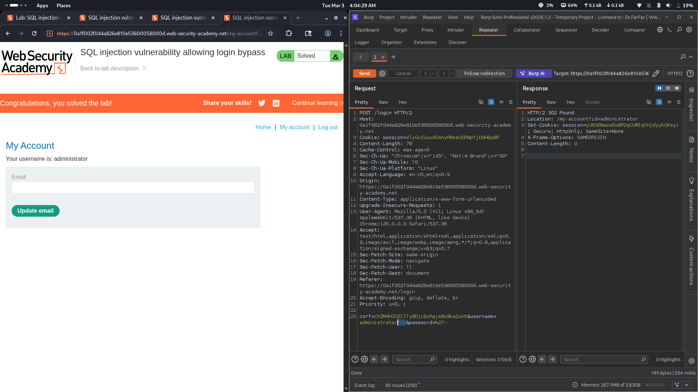

# Lab 02: SQL injection vulnerability allowing login bypass

## Category
SQL Injection - Authentication Bypass (Login Bypass)

## Vulnerability Summary
The login system contains a SQL injection vulnerability that allows attackers to bypass authentication entirely. By injecting a SQL payload in the username parameter, the application skips password verification and grants access to user accounts. The vulnerability exists because the application terminates the SQL query processing after the username field, allowing comment operators to ignore the password check.

## Attack Methodology
1. **Reconnaissance:** Identified the login form with username and password fields.
2. **Input Testing:** Entered SQL injection payloads in the username parameter to test for vulnerabilities.
3. **Vulnerability Discovery:** Discovered that the `--` comment operator bypasses password verification.
4. **Payload Construction:** Crafted a SQL injection payload using `administrator'--` to close the username string and comment out the password check.
5. **Execution:** The injected payload causes the SQL query to ignore password validation.
6. **Verification:** Successfully logged in as the administrator without knowing the password.



## Technical Root Cause
The vulnerability stems from improper handling of user input in the authentication query:

- **Unsanitized Input:** User input from the username field is directly concatenated into SQL queries.
- **Missing Parameterization:** The application does not use parameterized queries or prepared statements.
- **String Termination:** The `'` character closes the username string in the SQL query.
- **Comment Injection:** The `--` operator comments out the remainder of the query, including password verification.
- **Query Structure:** The original query structure allows early termination without causing syntax errors.
- **No Input Validation:** The application accepts SQL special characters without validation or sanitization.

### Payload Used
```
administrator'--
```

URL-encoded payload in login form:
```
username=administrator'--&password=anything
```

How it works:
- The original query likely looks like: `SELECT * FROM users WHERE username = 'input' AND password = 'input'`
- The injection transforms it to: `SELECT * FROM users WHERE username = 'administrator'--' AND password = 'anything'`
- The `'` closes the username string value.
- The `--` comments out everything after it, including the password check.
- The query effectively becomes: `SELECT * FROM users WHERE username = 'administrator'`
- The user is logged in as administrator without password verification.

## Impact
- **Account Takeover:** Attacker gains unauthorized access to any user account.
- **Privilege Escalation:** Attacker can access administrator accounts with elevated privileges.
- **Data Breach:** Sensitive user data becomes accessible to unauthorized parties.
- **Identity Theft:** Attacker can impersonate legitimate users.
- **Unauthorized Actions:** Attacker can perform actions on behalf of compromised accounts.
- **Complete Authentication Bypass:** The entire authentication mechanism is rendered useless.
- **Compliance Violation:** Authentication bypass violates security standards and regulations.

## Mitigation
1. **Parameterized Queries:** Use prepared statements with parameterized queries for all database operations.
2. **Input Validation:** Implement strict input validation rejecting SQL special characters in usernames.
3. **Escaping:** Properly escape all user input before including it in SQL queries.
4. **Password Hashing:** Store passwords using strong hashing algorithms (bcrypt, Argon2).
5. **Rate Limiting:** Implement rate limiting on login attempts to prevent brute force attacks.
6. **Multi-Factor Authentication:** Add additional authentication factors beyond username and password.
7. **Account Lockout:** Implement account lockout after multiple failed login attempts.
8. **Security Testing:** Conduct regular penetration testing and code reviews for SQL injection vulnerabilities.

---
*Lab completed on: 2026-03-03*
