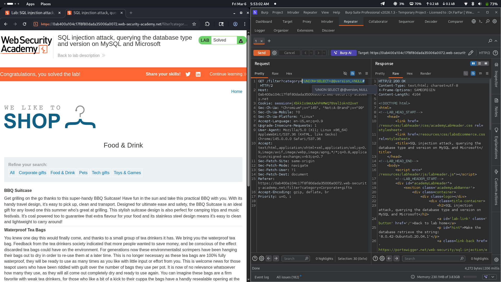

# Lab 04: SQL injection attack, querying the database type and version on MySQL and Microsoft

## Category
SQL Injection - UNION-based (Database Version Enumeration on MySQL/Microsoft)

## Vulnerability Summary
The website's product filtering feature contains a SQL injection vulnerability that allows attackers to retrieve database version information. By using a UNION-based SQL injection payload in the category parameter, the application exposes the MySQL database version. This vulnerability enables attackers to fingerprint the database system, which is often the first step in planning more advanced attacks.

## Attack Methodology
1. **Reconnaissance:** Identified the product category filter feature on the e-commerce website.
2. **Vulnerability Detection:** Tested for SQL injection by injecting SQL operators in the category parameter.
3. **Column Enumeration:** Determined the number of columns in the original query using ORDER BY or UNION SELECT with varying column counts.
4. **Payload Construction:** Crafted a UNION-based SQL injection payload to query the @@version variable.
5. **Execution:** The injected payload retrieves the MySQL database version information.
6. **Verification:** Confirmed successful data extraction by observing the database version displayed in the response.



## Technical Root Cause
The vulnerability stems from improper handling of user input in SQL query construction:

- **Unsanitized Input:** User input from the category filter is directly concatenated into SQL queries.
- **Missing Parameterization:** The application does not use parameterized queries or prepared statements.
- **UNION Operator Exploitation:** The UNION operator allows combining results from multiple SELECT statements.
- **MySQL Version Variable:** MySQL's @@version system variable contains database version information accessible through SQL.
- **Column Matching:** The attacker matches the number of columns in the original query to successfully inject data.
- **No Input Validation:** The application accepts SQL operators and special characters without validation.

### Payload Used
```
'+UNION+SELECT+@@version,NULL#
```

URL-encoded payload in category filter:
```
/filter?category='+UNION+SELECT+@@version,NULL#
```

How it works:
- The original query likely looks like: `SELECT * FROM products WHERE category = 'input'`
- The injection transforms it to: `SELECT * FROM products WHERE category = '' UNION SELECT @@version, NULL#'`
- The `'` closes the category string value.
- The `UNION SELECT` combines the original query results with the @@version variable.
- The `@@version` returns the MySQL database version string (e.g., '8.0.42-Ubuntu0.20.04.1').
- The `NULL` fills the second column to match the original query structure.
- The `#` comments out the rest of the original query (MySQL comment syntax).
- The database version is displayed alongside product results.

## Impact
- **Database Fingerprinting:** Attacker identifies the exact database type and version for targeted attacks.
- **Information Disclosure:** Internal database information is exposed to unauthorized parties.
- **Attack Planning:** Knowledge of database version helps attacker craft version-specific exploits.
- **Security Posture Weakening:** Exposed database information aids in planning advanced SQL injection attacks.
- **Compliance Violation:** Information leakage may violate security standards and regulations.
- **Further Exploitation:** This technique can be extended to extract table names, column names, and sensitive data.
- **Reputation Damage:** Public disclosure of SQL injection vulnerabilities affects user trust.

## Mitigation
1. **Parameterized Queries:** Use prepared statements with parameterized queries for all database operations.
2. **Input Validation:** Implement strict input validation allowing only expected category values.
3. **Whitelist Approach:** Use a whitelist of valid category names instead of accepting raw input.
4. **Error Handling:** Implement generic error messages that do not reveal database structure or version.
5. **Database Permissions:** Restrict access to system variables like @@version for application database accounts.
6. **ORM Usage:** Consider using Object-Relational Mapping (ORM) frameworks that handle SQL safely.
7. **Web Application Firewall:** Deploy WAF rules to detect and block UNION-based SQL injection attempts.
8. **Regular Security Testing:** Conduct periodic penetration testing and code reviews for SQL injection.

---
*Lab completed on: 2026-03-06*
