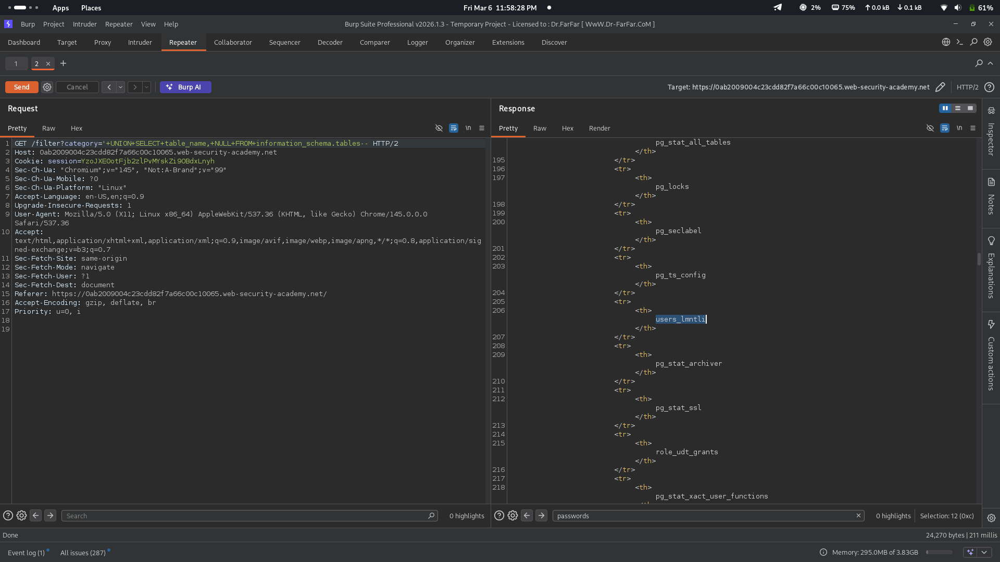
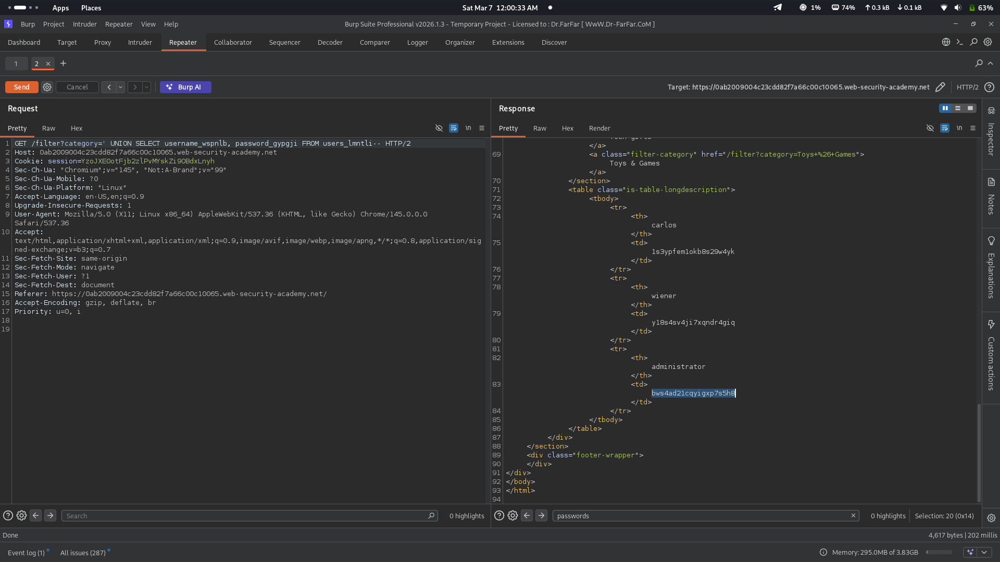

# Lab 05: SQL injection attack, extracting data from other tables

## Category
SQL Injection - UNION-based (Data Exfiltration from Multiple Tables)

## Vulnerability Summary
The website's product filtering feature contains a SQL injection vulnerability that allows attackers to extract data from any table in the database. By using UNION-based SQL injection payloads, the application can be manipulated to reveal table names from `information_schema.tables` and subsequently extract sensitive data such as usernames and passwords from the users table. This vulnerability demonstrates how SQL injection can lead to complete database compromise.

## Attack Methodology
1. **Reconnaissance:** Identified the product category filter feature on the e-commerce website.
2. **Column Enumeration:** Determined the number of columns in the original query using ORDER BY or UNION SELECT with varying column counts.
3. **Table Enumeration:** Crafted a payload to query `information_schema.tables` to discover all table names in the database.
4. **Target Identification:** Found the `users_lmntli` table containing user credentials.
5. **Data Extraction:** Crafted a payload to extract usernames and passwords from the users table.
6. **Verification:** Confirmed successful data extraction by observing user credentials displayed in the response.




## Technical Root Cause
The vulnerability stems from improper handling of user input in SQL query construction:

- **Unsanitized Input:** User input from the category filter is directly concatenated into SQL queries.
- **Missing Parameterization:** The application does not use parameterized queries or prepared statements.
- **UNION Operator Exploitation:** The UNION operator allows combining results from multiple SELECT statements.
- **Information Schema Access:** PostgreSQL's `information_schema.tables` contains metadata about all tables accessible to the current user.
- **Column Matching:** The attacker matches the number and data types of columns in the original query to successfully inject data.
- **No Input Validation:** The application accepts SQL operators and special characters without validation.

### Payloads Used

**Step 1: Enumerate Table Names**
```
'+UNION+SELECT+table_name,NULL+FROM+information_schema.tables--
```

This payload queries the `information_schema.tables` system table to list all tables in the database:
- `table_name` - Returns the name of each table
- `NULL` - Fills the second column to match the original query structure
- `--` - Comments out the rest of the original query

Results revealed tables including:
- `pg_stat_all_tables`
- `pg_locks`
- `users_lmntli` (target table)
- `pg_stat_archiver`
- And other PostgreSQL system tables

**Step 2: Extract User Credentials**
```
'+UNION+SELECT+username_wspnlb,password_gypgji+FROM+users_lmntli--
```

This payload extracts all usernames and passwords from the users table:
- `username_wspnlb` - Column containing usernames
- `password_gypgji` - Column containing passwords
- `users_lmntli` - The target table name discovered in step 1

Extracted credentials:
| Username | Password |
|----------|----------|
| carlos | 1s3ypfem1okb8s29w4yk |
| wiener | y18s4sv4ji7xqndr4qiq |
| administrator | bws4ad21cqyigxp7s5h8 |

## Impact
- **Complete Data Breach:** Attacker can extract all data from any table in the database.
- **Credential Theft:** User passwords are exposed, enabling account takeover.
- **Privilege Escalation:** Administrator credentials allow full application control.
- **Database Schema Exposure:** Table and column names reveal database structure.
- **Compliance Violation:** Data extraction violates privacy regulations (GDPR, PCI-DSS).
- **Further Exploitation:** Extracted data can be used for additional attacks (credential stuffing, lateral movement).
- **Reputation Damage:** Public disclosure of data breach affects user trust and business reputation.

## Mitigation
1. **Parameterized Queries:** Use prepared statements with parameterized queries for all database operations.
2. **Input Validation:** Implement strict input validation allowing only expected category values.
3. **Whitelist Approach:** Use a whitelist of valid category names instead of accepting raw input.
4. **Least Privilege:** Database accounts should have minimal permissions - restrict access to `information_schema`.
5. **Password Hashing:** Store passwords using strong hashing algorithms (bcrypt, Argon2) instead of plaintext.
6. **ORM Usage:** Consider using Object-Relational Mapping (ORM) frameworks that handle SQL safely.
7. **Web Application Firewall:** Deploy WAF rules to detect and block UNION-based SQL injection attempts.
8. **Regular Security Testing:** Conduct periodic penetration testing and code reviews for SQL injection.

---
*Lab completed on: 2026-03-07*
