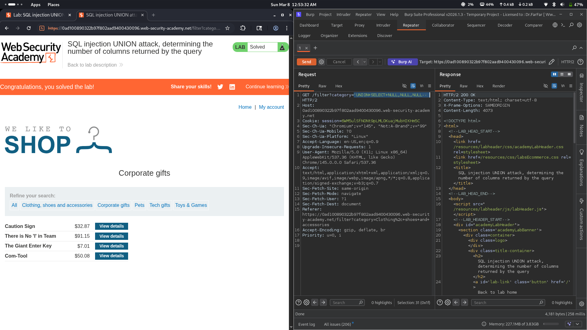

# Lab 07: SQL injection UNION attack, determining the number of columns returned by the query

## Category
SQL Injection - UNION-based (Column Enumeration)

## Vulnerability Summary
The website's product filtering feature contains a SQL injection vulnerability that allows attackers to determine the number of columns returned by the original SQL query. By using UNION SELECT with incrementing NULL values, the application reveals the column count through error messages or successful query execution. This is a critical reconnaissance step that enables further UNION-based SQL injection attacks for data exfiltration.

## Steps to Reproduce
1. Navigate to the e-commerce website's product category filter.
2. Identify the injection point in the `category` parameter of the URL.
3. Test for SQL injection by injecting a single quote (`'`) and observing errors.
4. Begin column enumeration using UNION SELECT with NULL values:
   - Start with: `'+UNION+SELECT+NULL--` (1 column)
   - If error, try: `'+UNION+SELECT+NULL,NULL--` (2 columns)
   - Continue incrementing until no error occurs
5. The lab requires 3 columns for successful injection.
6. Inject the payload: `'+UNION+SELECT+NULL,NULL,NULL--`
7. Observe the response - if the page loads without error and displays additional content, the column count is correct.
8. Verify successful exploitation by checking that the response includes expected content (e.g., "Corporate gifts" category page loads normally).



## Technical Root Cause
The vulnerability stems from improper handling of user input in SQL query construction:

- **Unsanitized Input:** User input from the category filter is directly concatenated into SQL queries.
- **Missing Parameterization:** The application does not use parameterized queries or prepared statements.
- **UNION Operator Exploitation:** The UNION operator allows combining results from multiple SELECT statements.
- **Column Count Disclosure:** The application reveals column count information through differential error responses.
- **No Input Validation:** The application accepts SQL operators and special characters without validation.

### Payload Used
```
'+UNION+SELECT+NULL,NULL,NULL--
```

URL-encoded payload in category filter:
```
/filter?category='+UNION+SELECT+NULL,NULL,NULL--
```

How it works:
- The original query likely looks like: `SELECT * FROM products WHERE category = 'input' AND released = 1`
- The injection transforms it to: `SELECT * FROM products WHERE category = '' UNION SELECT NULL, NULL, NULL--' AND released = 1`
- The `'` closes the category string value.
- The `UNION SELECT NULL, NULL, NULL` attempts to combine results with 3 NULL values.
- If the column count matches, the query executes successfully.
- If the column count doesn't match, the database returns an error like "SELECTs have different number of columns".
- The `--` comments out the rest of the original query.

### Column Enumeration Process
| Attempt | Payload | Result |
|---------|---------|--------|
| 1 | `'+UNION+SELECT+NULL--` | Error (wrong column count) |
| 2 | `'+UNION+SELECT+NULL,NULL--` | Error (wrong column count) |
| 3 | `'+UNION+SELECT+NULL,NULL,NULL--` | Success (3 columns) |

## Impact
- **Reconnaissance Enablement:** Column enumeration is the first step toward data exfiltration.
- **Foundation for Further Attacks:** Once column count is known, attackers can extract sensitive data.
- **Database Structure Disclosure:** Reveals information about the underlying database query structure.
- **Data Breach Risk:** Enables subsequent attacks to extract usernames, passwords, and other sensitive data.
- **Compliance Violation:** SQL injection vulnerabilities violate security standards (OWASP Top 10, PCI-DSS).
- **Reputation Damage:** Public disclosure of SQL injection vulnerabilities affects user trust.

## Mitigation
1. **Parameterized Queries:** Use prepared statements with parameterized queries for all database operations.
2. **Input Validation:** Implement strict input validation allowing only expected category values.
3. **Whitelist Approach:** Use a whitelist of valid category names instead of accepting raw input.
4. **Error Handling:** Implement generic error messages that don't reveal database structure information.
5. **Least Privilege:** Database accounts should have minimal permissions required for application function.
6. **ORM Usage:** Consider using Object-Relational Mapping (ORM) frameworks that handle SQL safely.
7. **Web Application Firewall:** Deploy WAF rules to detect and block UNION-based SQL injection attempts.
8. **Regular Security Testing:** Conduct periodic penetration testing and code reviews for SQL injection.

---
*Lab completed on: 2026-03-08*
